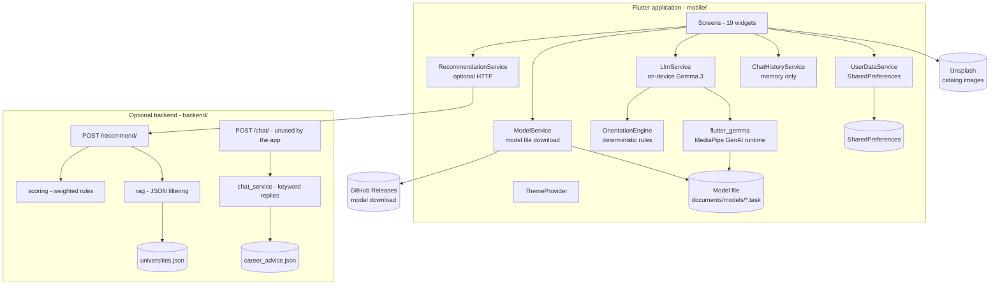
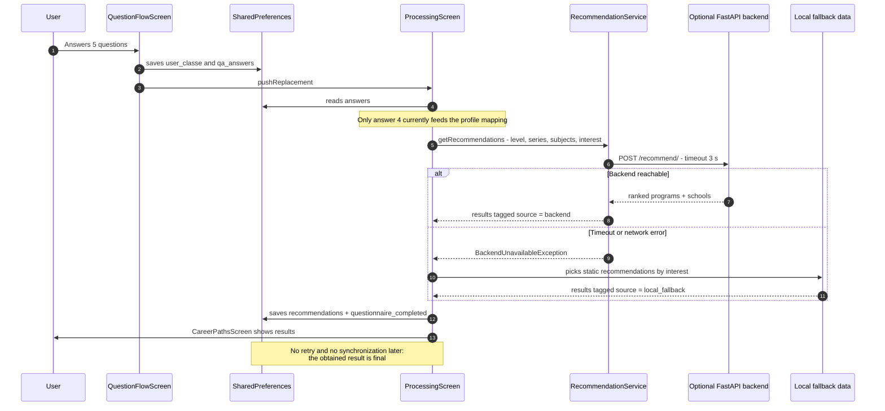
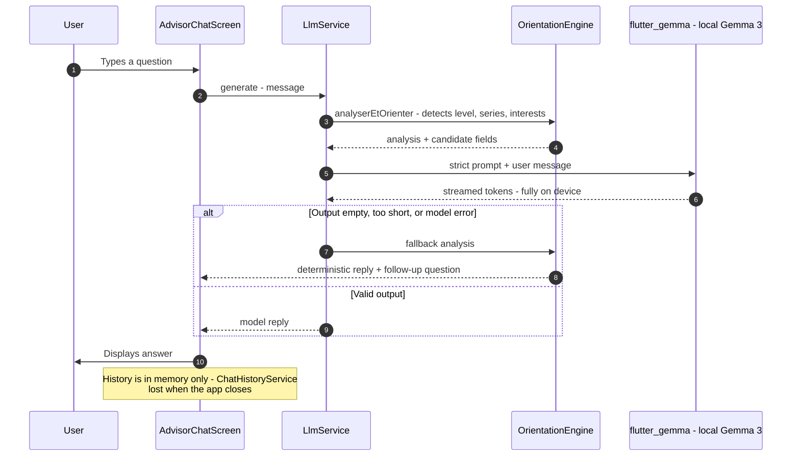
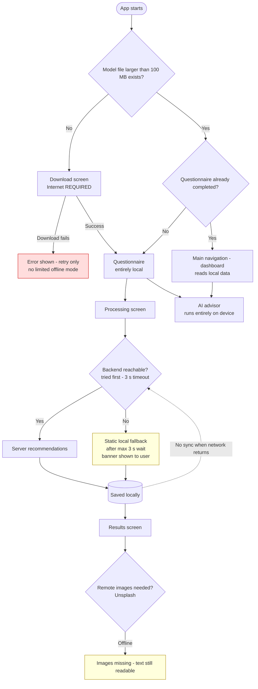
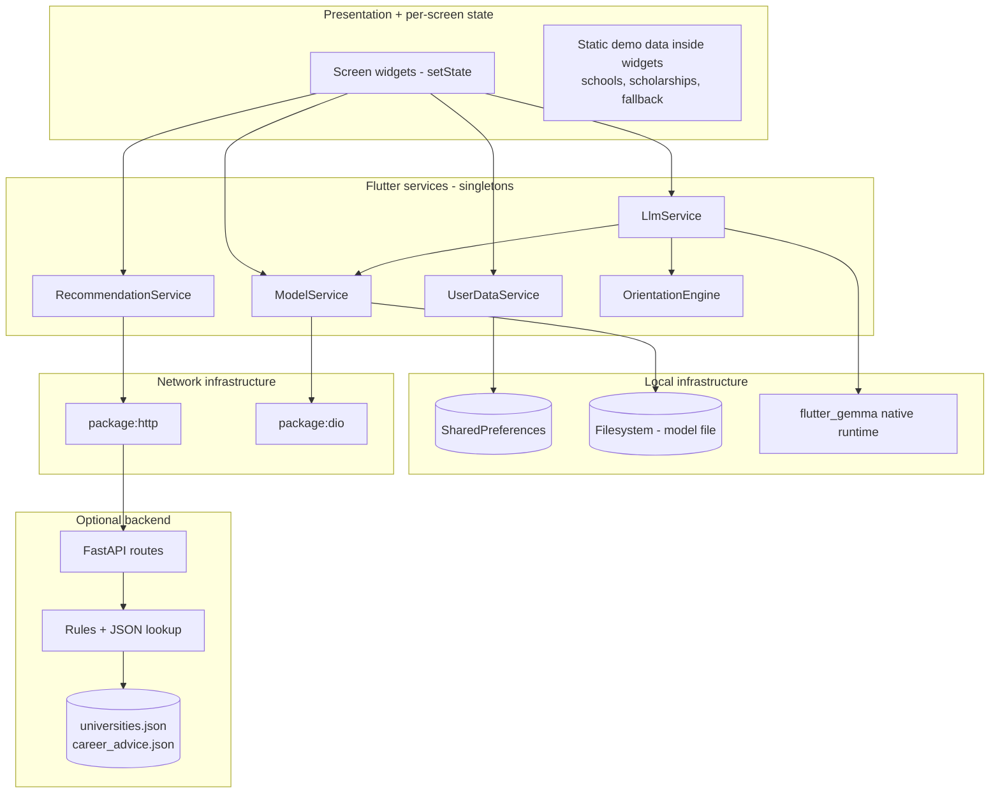

# CareerGuide AI

**CareerGuide AI** is a mobile application that helps students in Burkina Faso
choose their academic and career path after the BEPC (junior high diploma) or
the BAC (high school diploma). It offers a short interest questionnaire,
study-field recommendations, and an AI guidance advisor that runs **on the
device** using a local Gemma 3 model.

[](https://flutter.dev)
[](https://dart.dev)
[](https://fastapi.tiangolo.com)
[](https://github.com/TaniaW777/CareerGuide-AI)
[](#offline-and-online-behavior)
[](LICENSE)

## Project Overview

The application targets a context where reliable Internet connectivity cannot
be assumed. Its distinctive feature is a guidance chat advisor powered by a
small language model (Gemma 3 1B, 4-bit quantized) that is downloaded once and
then executed entirely on the phone with the [`flutter_gemma`][gemma-pub]
plugin (MediaPipe GenAI runtime). No conversation content is sent to any
server.

Around that advisor, the app provides:

- a local interest questionnaire (5 questions, BEPC or BAC level);
- study-field recommendations, produced by an **optional** FastAPI backend
  when reachable, or by a built-in local fallback otherwise;
- a browsable catalog of schools, scholarships, and series guides (static
  demo data embedded in the app);
- a local profile and a light/dark theme.

A small FastAPI backend is included in the repository. It is **not required**
to use the application: see [Backend role and availability](#backend-role-and-availability).

In short: **CareerGuide AI is offline-capable after the initial model
download, with optional backend enhancement and a local fallback.**

## Current Version and Status

- Version: `1.0.0+1` (`mobile/pubspec.yaml`)
- Status: **first public version** — usable, but early-stage.
- No automated tests yet (Dart or Python).
- The user interface is currently in French.
- Verified by execution: backend startup and routes, debug APK build
  (`flutter build apk --debug`). Not verified by execution: release APK,
  GitHub Pages deployment, iOS, desktop targets, and the Web build's model
  flow (see [Web deployment](#web-deployment)).

## Screenshots

No screenshots are committed to the repository yet. The table below lists the
placeholders to fill in; the only committed images are the logo and the
welcome illustration (`mobile/assets/images/`), which are not screenshots.

| Screen | Screenshot |
| --- | --- |
| Welcome | `<!-- TODO: add docs/screenshots/welcome.png -->` |
| Model download | `<!-- TODO: add docs/screenshots/download.png -->` |
| Questionnaire | `<!-- TODO: add docs/screenshots/questionnaire.png -->` |
| Recommendations | `<!-- TODO: add docs/screenshots/recommendations.png -->` |
| AI advisor | `<!-- TODO: add docs/screenshots/advisor.png -->` |

## Features That Actually Exist

| Feature | Status | Notes |
| --- | --- | --- |
| Interest questionnaire (5 questions, BEPC/BAC) | Implemented, fully local | Answers stored in `SharedPreferences` |
| On-device AI advisor (Gemma 3 1B int4) | Implemented, runs locally after one-time download | Deterministic rule-based fallback when the model fails |
| Study-field recommendations | Implemented, hybrid | Optional backend first (3 s timeout), local static fallback otherwise; result origin is marked and displayed |
| School / scholarship / guide catalogs | Implemented, static demo data | Hard-coded in the app; images loaded from Unsplash (needs Internet) |
| Local profile editing | Implemented | Local only; see known limitations about profile keys |
| Light / dark theme | Implemented, persisted | |
| Application (candidature) form | **Simulated** | Displays a "simulation" confirmation; nothing is transmitted |
| Notifications | **Demo data** | Hard-coded sample notifications, not generated by a service |
| Language settings | **Not functional** | The radio buttons in Settings are decorative no-ops |
| Account creation / login | **Dead code** | `AuthScreen` and `ProfileSetupScreen` exist but are unreachable; no real authentication exists anywhere |
| Chat history persistence | **Not implemented** | Conversation is lost when the app closes |
| Sync after reconnection | **Not implemented** | No connectivity detection, no upload queue |

## Architecture Overview

The project deliberately uses a simple two-part layout:

- **`mobile/` — Flutter application.** A "screens + services" structure:
  19 self-contained screen widgets hold their own local state (the only app
  wide state is the theme), and six singleton services handle everything
  else: local inference (`LlmService`), model file management
  (`ModelService`), the optional recommendation API
  (`RecommendationService`), local persistence (`UserDataService`), in-memory
  chat history (`ChatHistoryService`), and a deterministic rules engine
  (`OrientationEngine`). There is no bloc/cubit/controller layer and no
  repository layer.
- **`backend/` — optional FastAPI service.** Two mounted routes backed by
  plain Python functions and two JSON files. No database, no authentication,
  no CORS middleware, no AI model.

Key entry points:

| Flow | Entry point |
| --- | --- |
| App startup | `mobile/lib/main.dart` — `main()` preloads the LLM in the background, then shows `SplashScreen` |
| First-launch routing | `mobile/lib/screens/splash_screen.dart` — `_determineDestination()` (model check → download screen, else questionnaire state) |
| Model download | `mobile/lib/screens/download_screen.dart` → `mobile/lib/services/model_service.dart` — `downloadModel()` |
| Questionnaire | `mobile/lib/screens/question_flow_screen.dart` — `_next()` stores answers |
| Recommendations | `mobile/lib/screens/processing_screen.dart` — `_processAndNavigate()` |
| AI advisor | `mobile/lib/screens/advisor_chat_screen.dart` — `_sendMessage()` → `LlmService.generate()` |
| Backend | `backend/app/main.py` — FastAPI app mounting `/recommend/` and `/chat/` |

## Architecture Diagrams

### 1. Real component architecture



Confirmed: every edge corresponds to a verified import or call. `POST /chat/`
exists on the backend but is never called by the mobile app; `GET /model/status`
(`backend/app/api/model.py`) is defined but **not mounted** in
`backend/app/main.py`. Limitation: `AuthScreen`/`ProfileSetupScreen` are dead
code and intentionally omitted.

### 2. Real recommendation interaction



Confirmed: backend attempted first, then fallback (`mobile/lib/screens/processing_screen.dart`
and `mobile/lib/services/recommendation_service.dart`). The fallback is
**static** (per-interest canned lists), not a personalized local algorithm.
Limitation: there is no later re-submission when connectivity returns.

### 3. Real local AI advisor interaction



Confirmed: the advisor never contacts the backend; inference is local
(`mobile/lib/services/llm_service.dart`). Limitation: the deterministic
fallback only knows 3 hard-coded fields (`mobile/lib/services/orientation_engine.dart`),
and chat history is not persisted.

### 4. First-launch and offline behavior



Confirmed: first launch without Internet is blocked on the download screen
(no skip button); later launches need no connectivity; the backend is still
attempted on every recommendation and costs up to 3 s before falling back.
Limitation: no connectivity listener and no synchronization exist anywhere in
`mobile/lib/`.

### 5. Observed layers and boundaries



Confirmed: the boundaries are coarse by design — screens talk to services
directly, and reference data lives inside widgets rather than a data layer.
This is an honest depiction, not a Clean Architecture claim.

## Why This Architecture

For a first public version targeting students with intermittent connectivity
and low-end Android phones, the current shape is a reasonable trade-off:

- **Simplicity and maintainability.** A flat "screens + services" structure
  with ~9,000 lines of Dart is easy to read and fork. There is no generated
  code, no dependency injection framework, and no layer bureaucracy; the cost
  is mixed responsibilities (e.g., fallback data lives inside
  `ProcessingScreen`, catalog data inside list widgets).
- **Local privacy.** The advisor's conversations never leave the device. The
  only data sent over the network is the questionnaire-derived profile
  (level, series, subjects, interest) posted to the optional recommendation
  endpoint — and only when that endpoint is reachable.
- **Offline resilience.** The expensive, connectivity-dependent part (the LLM)
  was made local by design; the cheap part (recommendations) degrades to a
  static fallback instead of blocking the flow.
- **Trade-offs accepted today:** a ~570 MB one-time download; generic
  fallback recommendations instead of a personalized local algorithm;
  duplicated profile storage keys; and a backend that is integrated but only
  deployable by the developer for now.

## Backend Role and Availability

**Classification: optional enrichment service** (with a development-only
deployment today).

Evidence:

| Question | Answer | Evidence |
| --- | --- | --- |
| Which screens call the backend? | Exactly one: `ProcessingScreen`, after the questionnaire | `mobile/lib/screens/processing_screen.dart` (`_processAndNavigate`) |
| Which routes does the app consume? | `POST /recommend/` only | `mobile/lib/services/recommendation_service.dart` |
| Routes present but unused | `POST /chat/` (never called); `GET /model/status` (defined in `backend/app/api/model.py`, not mounted in `backend/app/main.py`) | |
| Does the backend contain an AI model? | **No.** `scoring.py` is weighted if/else rules; `rag.py` filters `universities.json`; `chat_service.py` matches keywords. No ML library is imported | `backend/app/services/*` |
| Required to complete the questionnaire? | No — the questionnaire is entirely local | `mobile/lib/screens/question_flow_screen.dart` |
| Required for recommendations? | No — attempted first, static local fallback otherwise | `processing_screen.dart`, `recommendation_service.dart` |
| Is the fallback personalized? | No — static lists per interest category | `_fallbackRecommendations()` in `processing_screen.dart` |
| Required for the AI advisor? | No — inference is on-device | `mobile/lib/services/llm_service.dart` |
| Sync after reconnection / upload queue? | None | no connectivity or queue code in `mobile/lib/` |
| Publicly deployed? | No. The base URL defaults to `http://10.0.2.2:8000` (Android emulator loopback) and must be overridden with `--dart-define` | `recommendation_service.dart` |

Therefore the accurate statement is:

> The backend is used as an optional enrichment service when reachable; the
> application falls back to local processing when it is unavailable. Only the
> server-backed recommendation detail is lost when the backend is absent —
> the questionnaire, the local advisor, and fallback recommendations keep
> working.

## Offline and Online Behavior

CareerGuide AI is offline-capable after the initial model download, with
optional backend enhancement and a local fallback. Concretely, the advisor and
the questionnaire are fully local; recommendations are produced by the
optional backend when reachable, and by static local data otherwise. The
first launch still requires Internet, as detailed below.

### First launch

- Internet **is required**: the splash screen routes to the download screen
  until the model file (~570 MB, per the on-screen copy) exists locally
  (`splash_screen.dart` → `ModelService().modelExists()`, which requires the
  file to be larger than 100 MB).
- The download cannot be skipped from the download screen (no skip button);
  a failed download shows an error with a retry option. There is no limited
  offline mode yet.
- The model is fetched from a public GitHub Release:
  `https://github.com/TaniaW777/CareerGuide-AI/releases/download/v1.0/gemma3-1B-it-int4.task`
  (`mobile/lib/services/model_service.dart:7`). The `v1.0` release exists on
  the repository; the exact asset filename was not verified against the
  release page.

### After the model is installed

| Capability | Offline? | Details |
| --- | --- | --- |
| App starts and reopens | Yes | No network call at startup |
| Questionnaire | Yes | Fully local |
| Answers stored locally | Yes | `SharedPreferences` (`qa_answers`, `user_classe`) |
| Recommendations | Yes, degraded | Backend attempted first (3 s timeout), then static fallback; a banner tells the user the result is local |
| AI advisor | Yes | Fully on-device, with a deterministic fallback if inference fails |
| School/scholarship guides | Yes (text) | Data is embedded; **images are remote** (Unsplash) and disappear offline |
| Data survives restart | Yes | Questionnaire, recommendations, profile, theme, model file |
| Chat history survives restart | **No** | In-memory only |
| Reconnection triggers sync | **No** | No connectivity detection exists |

## Known Limitations and Current Gaps

- First launch requires Internet and a large (~570 MB) model download; no
  skip / limited mode.
- Offline recommendations are static per interest category; only one of the
  five questionnaire answers currently feeds the profile mapping sent for
  recommendations (`processing_screen.dart`).
- The backend is integrated but has no public deployment; out of the box, the
  app always uses the fallback on a real device.
- `POST /chat/` on the backend is unused; `GET /model/status` is not mounted.
- Backend has no CORS middleware — browser clients would be blocked (mobile
  clients are unaffected).
- Two families of `SharedPreferences` profile keys coexist
  (`user_name`/`user_region` in `UserDataService` vs `user_nom`/`user_ville`
  in the profile screens), so the name entered in the profile never shows up
  on the dashboard. This is a known bug.
- Chat history is lost when the app closes.
- School/scholarship/notifications data is hard-coded demo content; the
  application form is an explicit simulation.
- The language selector in Settings is decorative (no-op).
- Login/account screens exist but are unreachable (no real authentication).
- No automated tests; several unused dependencies remain declared
  (`video_player`, `flutter_spinkit`, `font_awesome_flutter`).
- The Web build compiles, but the model flow uses `dart:io` and
  `path_provider`, which do not work in browsers — the advisor is not
  expected to function on the GitHub Pages deployment (untested).

## Technology Stack

| Layer | Technology |
| --- | --- |
| Mobile app | Flutter (Dart 3.x), Material |
| State management | `provider` (theme only) + per-screen `setState` |
| Local inference | `flutter_gemma` 0.9.0 (MediaPipe GenAI, Gemma 3 1B int4 `.task` model) |
| Local storage | `shared_preferences` (key/value), filesystem via `path_provider` |
| Networking | `http` (recommendation API), `dio` (model download) |
| Fonts | `google_fonts` |
| Backend | Python 3, FastAPI, Pydantic, Uvicorn |
| Backend data | Two JSON files (`universities.json`, `career_advice.json`) — no database |
| CI/CD | GitHub Actions → Flutter Web build → GitHub Pages (`gh-pages` branch) |

## Repository Structure

```
careerguide_ai/
├── .github/workflows/deploy.yml      # GitHub Pages deployment (builds mobile/ as Web)
├── README.md
├── backend/                          # OPTIONAL FastAPI service
│   ├── requirements.txt              # fastapi, uvicorn, pydantic (UTF-8)
│   └── app/
│       ├── main.py                   # mounts /recommend/ and /chat/
│       ├── api/                      # recommendation.py, chat.py, model.py (not mounted)
│       ├── schemas/                  # Pydantic request models
│       ├── services/                 # scoring (rules), rag (JSON filter), chat (keywords)
│       └── data/                     # universities.json, career_advice.json
└── mobile/                           # Flutter application
    ├── pubspec.yaml
    ├── GITHUB_PAGES_CONFIG.md        # Pages setup notes
    ├── assets/images/, assets/videos/
    ├── android/, ios/, web/, linux/, macos/, windows/
    └── lib/
        ├── main.dart                 # entry point, LLM preload
        ├── core/                     # theme (ThemeProvider) + shared widgets
        ├── screens/                  # 19 screens
        └── services/                 # llm, model, recommendation, user_data, chat_history, orientation engine
```

## Prerequisites

- **Flutter SDK** (stable channel, Dart `^3.10.7` per `mobile/pubspec.yaml`)
  with the Android toolchain (Android Studio / SDK) to run on Android.
- For the optional backend: **Python 3.10+**.
- Internet access for the first app launch (model download) and to fetch
  packages.

## Installation

```bash
git clone https://github.com/TaniaW777/CareerGuide-AI.git
cd CareerGuide-AI
cd mobile
flutter pub get
```

Optional backend dependencies (isolated environment):

```bash
# from the repository root
python -m venv venv
venv/Scripts/activate          # Windows (use: source venv/bin/activate on Linux/macOS)
python -m pip install -r backend/requirements.txt
```

## Running the Mobile Application

```bash
cd mobile
flutter run                     # Android emulator (uses default API URL)
```

The first launch routes to the model download screen. After the ~570 MB model
is installed once, the advisor works without connectivity.

## Running the Backend (Optional)

```bash
# from the repository root — works from any directory
python -m uvicorn app.main:app --app-dir backend --reload --host 0.0.0.0 --port 8000
```

Verify: open <http://127.0.0.1:8000/docs> (Swagger UI), or:

```bash
curl http://127.0.0.1:8000/
curl -X POST http://127.0.0.1:8000/recommend/ -H "Content-Type: application/json" \
  -d '{"level":"Terminale (BAC)","series":"C","subjects":["Math"],"interest":"Technologie"}'
```

## Configuring the Backend URL

The API base URL is a compile-time constant — no address is hard-coded in
business logic (`mobile/lib/services/recommendation_service.dart`):

```bash
# Android emulator (default: http://10.0.2.2:8000)
flutter run

# Physical device on the developer's local network
flutter run --dart-define=API_BASE_URL=http://192.168.x.x:8000

# iOS simulator
flutter run --dart-define=API_BASE_URL=http://127.0.0.1:8000

# Release build against a deployed backend
flutter build apk --release --dart-define=API_BASE_URL=https://api.example.com
```

When the backend is unreachable, the app falls back to local recommendations
after a 3-second timeout and displays a banner stating the results are local.

## Building the Android APK

```bash
cd mobile
flutter build apk --release
# Output: mobile/build/app/outputs/flutter-apk/app-release.apk
```

A debug build was verified during the latest stabilization pass:

```bash
flutter build apk --debug
# Output: mobile/build/app/outputs/flutter-apk/app-debug.apk
```

## Web Deployment

A GitHub Actions workflow (`.github/workflows/deploy.yml`) builds the Flutter
Web app from `mobile/` (with `working-directory: mobile` and
`publish_dir: ./mobile/build/web`) and publishes to the `gh-pages` branch on
pushes to `main` or `frontend`. Expected Pages URL:
<https://taniaw777.github.io/CareerGuide-AI/>.

**Caveat (not verified by execution):** the workflow path fix is recent and
the advisor's model flow uses `dart:io` + `path_provider`, which do not run
in browsers. The Web build is expected to render screens but **not** to
support the local AI advisor without additional work.

## Contributing

Issues and pull requests are welcome. The highest-value contributions at this
stage are listed in the roadmap below. Before submitting:

1. Fork, create a feature branch.
2. For Dart changes: `cd mobile && flutter analyze` must report no new
   errors or warnings.
3. For backend changes: the server must start from the repository root
   (`python -m uvicorn app.main:app --app-dir backend`).
4. Describe what was tested by execution, and what was not.

## Versioning and Roadmap

Versioning follows `mobile/pubspec.yaml` (`1.0.0+1`).

Planned — **not implemented yet**:

- Use all five questionnaire answers in the recommendation mapping.
- Persist chat history locally.
- Unify the `SharedPreferences` profile keys (fixes the dashboard name bug).
- Optional limited mode on first launch without the model download.
- CORS configuration for the backend and a publicly deployed backend URL.
- Local personalized recommendations (embed the field/school catalog in the
  app) so the offline path matches server quality.
- Connectivity detection and deferred synchronization.
- Automated tests (Flutter and pytest).
- English UI localization (currently French only).

## Privacy and Responsible Use

- **Conversations stay on the device.** The AI advisor runs locally; messages
  are not uploaded. They are also not encrypted at rest (plain in-memory
  list) and disappear when the app closes.
- **Data sent over the network:** the questionnaire-derived profile
  (level, series, subjects, interest) is sent to the recommendation endpoint
  **only if** a backend is configured and reachable. No name, no email, no
  answers text is transmitted.
- **Account emails** (feature currently unreachable) would be stored locally
  only; passwords are never stored.
- Recommendations and AI advice are **guidance hints**, not authoritative
  decisions — students should verify entry requirements with the institutions
  listed.
- The school, scholarship, and notification data is demo content and may be
  outdated; the application form is a simulation and transmits nothing.

## License

This project is released under the [MIT License](LICENSE).

Copyright (c) 2026 TaniaW777 and CareerGuide AI contributors.

## Project Links

- Repository: <https://github.com/TaniaW777/CareerGuide-AI>
- GitHub Pages (Web build, advisor unsupported — see caveat):
  <https://taniaw777.github.io/CareerGuide-AI/>
- Model release (Gemma 3 `.task` file): <https://github.com/TaniaW777/CareerGuide-AI/releases/tag/v1.0>
- GitHub Pages setup notes: [`mobile/GITHUB_PAGES_CONFIG.md`](mobile/GITHUB_PAGES_CONFIG.md)

<!-- Reference links -->
[gemma-pub]: https://pub.dev/packages/flutter_gemma
