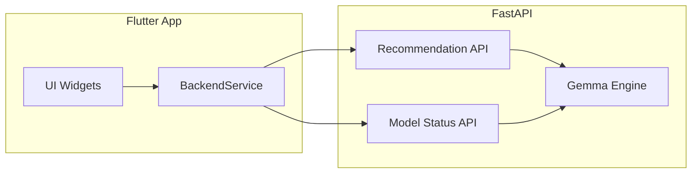

# CareerGuide AI – README

## Architecture Overview


## Local Development Setup
### Backend (Python)
```bash
cd CareerGuide-AI-backend/tania/backend/app
python -m venv .venv
.venv\Scripts\activate
pip install -r requirements.txt
uvicorn app.main:app --host 0.0.0.0 --port 8001
```
The server starts on **http://127.0.0.1:8001** and loads the Gemma model automatically.

### Frontend (Flutter)
```bash
cd CareerGuide_AI_frontend
flutter pub get
flutter run          # Windows desktop by default
# Android emulator (offline‑first mode works out‑of‑the‑box)
# iOS / real device – expose backend via BACKEND_URL env var
flutter run -d <device> \
  --dart-define=BACKEND_URL=http://<PC_IP>:8001
```
The app detects the platform and selects the correct backend URL (see `BackendConfig`).

## Testing
### Backend tests (pytest)
```bash
pip install pytest httpx
pytest tests/
```
`tests/test_model_status.py` checks the `/model/status` endpoint returns the expected JSON.

### Frontend sanity check
Run the app and open **Settings → Statut du modèle IA** – it should display **Prêt** when Gemma is loaded.

## Mobile Deployment
1. **Android** – no extra work; the emulator routes `10.0.2.2` to the host PC.
2. **Physical device** – ensure your PC and device share the same Wi‑Fi.  
   ```bash
   flutter run -d <device> \
     --dart-define=BACKEND_URL=http://<YOUR_PC_IP>:8001
   ```
3. **iOS** – similar, using your Mac’s IP address.

## FAQ
* **Why is the model sometimes *not* ready?**  The Gemma model is loaded lazily on first request.  If the backend started before the model files are cached, the status endpoint will return `gemma_ready: false` until loading finishes.
* **How to clear cached recommendations?**  In the Settings screen tap **Déconnexion** – this clears `SharedPreferences` and forces a fresh fetch.

---
*This README was generated and updated by the Antigravity coding assistant.*
